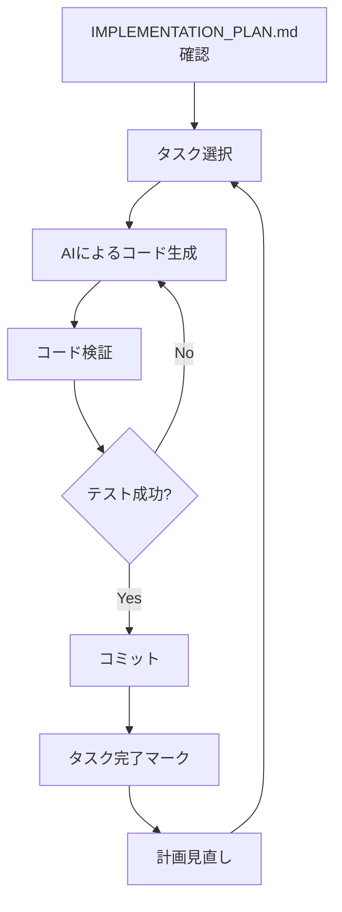

# Sake Sensei - Implementation Rules

## 📋 Implementation Process (AI-Driven)

### 実装フロー



### タスク実装ルール

1. **タスク粒度**: 1タスク = 1ファイル作成/編集 (5-15分)
2. **実装順序**: IMPLEMENTATION_PLAN.mdのPhase順に実施
3. **依存関係**: 依存タスクの完了を確認してから実施
4. **検証必須**: 各タスク後にruff/mypy/pytestを実行
5. **自動継続**: ユーザー確認なしで次タスクへ自動進行
6. **自動見直し**: 5タスク完了ごとに自動で計画評価・調整
7. **TASK_TRACKER.md更新必須**: 各タスク完了時およびPhase完了時に必ずTASK_TRACKER.mdを更新

### AI自律実装プロセス (MANDATORY)

**⚠️ 重要: AIは以下のプロセスを自律的に実行し、ユーザーに継続/見直しの確認を求めてはならない**

#### 実装サイクル
```
タスクN実装 → 検証 → 完了マーク → TASK_TRACKER更新
    ↓
タスクN+1へ自動継続
    ↓
5タスク完了？
    ↓ Yes
自動計画見直し → 調整（必要な場合のみ） → 継続
    ↓ No
継続
```

#### 自動判断基準

**継続する条件（ユーザー確認不要）:**
- タスクが正常に完了
- 依存関係が解決済み
- 次タスクの実装が可能

**停止する条件（ユーザー報告必要）:**
- エラーで実装不可能
- 設計上の重大な問題発見
- 外部リソースへのアクセスが必要（AWS認証情報など）

**自動見直し時の判断:**
- 新たな技術的制約の発見 → 計画調整
- より効率的な実装順序の発見 → 順序変更
- 不要なタスクの発見 → タスク削除
- 実装済み機能との重複発見 → タスクスキップ

#### 進捗報告のタイミング

- **5タスクごと**: 簡潔な進捗サマリー + 計画見直し結果
- **Phaseごと**: Phase完了報告 + 統合テスト結果
- **エラー時**: 即座にブロッカー報告

**報告フォーマット:**
```
✅ Phase X.Y 完了 (N/M タスク)
🔄 次: Phase X.Z (自動継続中)
⚠️ 調整: [あれば記載]
```

### AIへの実装指示テンプレート

```
タスク[番号]を実装:
- ファイル: [パス]
- 目的: [機能説明]
- 依存: [依存タスク]
- 検証: ruff format, ruff check, mypy
```

### コミットメッセージ規則

```
feat: [Phase X.Y] タスク名
例: feat: [Phase 0.1] Create pyproject.toml with basic dependencies
```

## ⚠️ Mandatory Requirements

### Package Manager: uv

This project **MUST** use **uv** for all package management operations.

- ❌ Do NOT use `pip install`, `poetry`, or `pipenv`
- ✅ Use `uv add`, `uv sync`, `uv run` for all operations
- All team members must have uv installed before contributing

**Basic commands:**

```bash
uv sync                    # Sync dependencies
uv add <package>          # Add dependency
uv add --dev <package>    # Add dev dependency
uv run <command>          # Run command in venv
```

### Linter/Formatter: Ruff

This project **MUST** use **Ruff** for code quality.

- ❌ Do NOT use `black`, `flake8`, `isort` separately
- ✅ Use `uv run ruff format` and `uv run ruff check`
- All code must pass ruff checks before committing

**Basic commands:**

```bash
uv run ruff format .      # Format code
uv run ruff check .       # Check linting
uv run ruff check --fix . # Auto-fix issues
```

## Technology Stack

### Frontend

- **Streamlit** (Python 3.12) on **ECS Fargate**
- **Container Orchestration**: AWS Copilot CLI
- **Load Balancer**: Application Load Balancer (ALB)
- **Authentication**: AWS Cognito via AgentCore Identity

### Agentic Framework

- **Strands Agents** on Amazon Bedrock AgentCore Runtime
- **Model**: Claude Sonnet 4.5 via Amazon Bedrock
- **Services**: Runtime, Gateway (MCP), Memory, Identity, Observability

### Backend

- **Lambda Functions**: Recommendation, Preference, Tasting, Brewery, Image Recognition
- **Database**: Amazon DynamoDB
- **Storage**: Amazon S3
- **Security**: AWS WAF, HTTPS

### AWS Region Configuration

**⚠️ IMPORTANT: This project deploys to `us-west-2` (Oregon) by default.**

- **Primary Region**: `us-west-2` (US West - Oregon)
- **Reason**:
  - Bedrock Claude 4.5 Sonnet availability
  - Lower latency for North American users
  - Cost-effective pricing tier
- **Configuration**:
  - Default region is set in `infrastructure/app.py`
  - All environment variables in `.env.example` use `us-west-2`
  - To change region, update `AWS_REGION` environment variable

**Supported Services in us-west-2:**
- ✅ Amazon Bedrock (Claude 4.5 Sonnet)
- ✅ Amazon DynamoDB
- ✅ Amazon S3
- ✅ Amazon Cognito
- ✅ AWS Lambda
- ✅ Amazon ECS Fargate

### Directory Structure

```text
SakeSensei/
├── streamlit_app/
│   ├── app.py                          # Main Streamlit app
│   ├── Dockerfile                      # Container image definition
│   ├── requirements.txt                # Python dependencies (generated from uv)
│   ├── pages/
│   │   ├── preference_survey.py        # User preference survey page
│   │   ├── recommendations.py          # AI-powered recommendations page
│   │   ├── rating.py                   # Sake rating and feedback page
│   │   ├── image_recognition.py        # Label photo upload and recognition
│   │   └── history.py                  # Tasting history and analytics
│   ├── components/
│   │   ├── auth.py                     # Cognito authentication UI
│   │   ├── agent_client.py             # AgentCore Runtime client
│   │   └── sake_card.py                # Sake display component
│   └── utils/
│       ├── config.py                   # App configuration
│       └── session.py                  # Session state management
├── agent/
│   ├── agent.py                        # Main Strands Agent definition
│   ├── entrypoint.py                   # AgentCore Runtime entrypoint (@app.entrypoint)
│   ├── system_prompt.py                # Agent system prompt and instructions
│   ├── memory_hook.py                  # AgentCore Memory integration hooks
│   ├── tools/                          # Custom agent tools
│   │   └── recommendation_tool.py      # Recommendation generation tool
│   └── requirements.txt                # Agent dependencies
├── backend/
│   ├── lambdas/
│   │   ├── recommendation/             # Recommendation engine Lambda
│   │   │   ├── handler.py              # Lambda handler (MCP tool format)
│   │   │   ├── algorithm.py            # Recommendation algorithm
│   │   │   └── requirements.txt
│   │   ├── preference/                 # User preference management
│   │   │   ├── handler.py
│   │   │   └── requirements.txt
│   │   ├── tasting/                    # Tasting record management
│   │   │   ├── handler.py
│   │   │   └── requirements.txt
│   │   ├── brewery/                    # Brewery information
│   │   │   ├── handler.py
│   │   │   └── requirements.txt
│   │   └── image_recognition/          # Image recognition Lambda
│   │       ├── handler.py
│   │       └── requirements.txt
│   └── infrastructure/
│       ├── dynamodb.yaml               # DynamoDB table definitions
│       ├── waf.yaml                    # WAF rules
│       └── iam_roles.yaml              # IAM roles for AgentCore
├── copilot/
│   ├── .workspace                      # Copilot workspace config
│   ├── environments/
│   │   ├── dev/
│   │   │   └── manifest.yml            # Dev environment config
│   │   └── prod/
│   │       └── manifest.yml            # Prod environment config
│   └── streamlit-app/
│       ├── manifest.yml                # ECS service definition
│       └── addons/
│           └── alb.yml                 # ALB configuration
├── scripts/
│   ├── create_gateway.py               # Create AgentCore Gateway
│   ├── add_gateway_targets.py          # Add Lambda targets to Gateway
│   ├── create_memory.py                # Create AgentCore Memory store
│   ├── setup_identity.py               # Setup AgentCore Identity with Cognito
│   ├── enable_observability.py         # Enable AgentCore Observability
│   └── deploy_agent.py                 # Deploy agent to Runtime
├── data/
│   ├── sake_master.json                # Sake master data
│   └── brewery_master.json             # Brewery master data
├── tests/
│   ├── unit/                           # Unit tests
│   ├── integration/                    # Integration tests
│   ├── e2e/                            # End-to-end tests
│   └── agent/                          # Agent-specific tests
│       ├── test_agent_local.py         # Test agent locally
│       └── test_agent_runtime.py       # Test deployed agent
├── .streamlit/
│   └── config.toml
├── pyproject.toml                      # uv package management
├── .env.example
├── .agentcore.yaml                     # AgentCore configuration (generated)
├── DESIGN.md
├── REQUIREMENTS.md
├── TASKS.md
└── CLAUDE.md
```

## Naming Conventions

### Python

- **Files**: `snake_case` (e.g., `api_client.py`)
- **Functions**: `snake_case` (e.g., `get_recommendations()`)
- **Classes**: `PascalCase` (e.g., `CognitoAuth`)
- **Constants**: `UPPER_SNAKE_CASE` (e.g., `USERS_TABLE`)

### AWS Resources

- Use `kebab-case` with project prefix
- Examples: `SakeSensei-Users`, `sakesensei-recommendation`

### GraphQL

- **Types**: `PascalCase` (e.g., `User`, `Sake`)
- **Fields/Queries**: `camelCase` (e.g., `userId`, `getRecommendations`)

## Code Style

### Python

- Follow **PEP 8** style guide
- Use **type hints** for all function signatures
- Maximum line length: **100 characters**
- Add **docstrings** for all public functions and classes
- Use **Ruff** for linting and formatting

### Other Formats

- **GraphQL**: 2 spaces indentation, PascalCase types, camelCase fields
- **YAML**: 2 spaces indentation, kebab-case keys
- **JSON**: 2 spaces indentation

## Development Guidelines

### Error Handling

- Always catch specific exceptions before generic ones
- Log errors with context using Python logging module
- Return user-friendly error messages in Streamlit
- Use try-except blocks for all external API calls

### Logging

- Use Python's built-in `logging` module
- Set appropriate log levels (DEBUG, INFO, WARNING, ERROR)
- Include contextual information in logs
- Never log sensitive data (tokens, passwords)

### Environment Variables

- Use `.env` for local development (never commit to git)
- Use AWS Systems Manager Parameter Store or Secrets Manager for production
- Inject into ECS container via Copilot manifest
- Required variables: `AWS_REGION`, `COGNITO_USER_POOL_ID`, `COGNITO_CLIENT_ID`, `AGENTCORE_RUNTIME_URL`

## Testing

### Testing Requirements

- **Unit Tests**: Use pytest with pytest-asyncio, 70% coverage minimum
- **Integration Tests**: Test Lambda + DynamoDB, Gateway tool invocations
- **E2E Tests**: Use Selenium/Playwright for Streamlit UI testing
- **Test Naming**: `test_<module_name>.py`

### Running Tests

```bash
uv run pytest                    # Run all tests
uv run pytest --cov              # Run with coverage
uv run pytest tests/unit/ -v     # Run specific test directory
```

## Security

### Required Security Practices

1. **Never commit secrets** - Use environment variables
2. **Validate all inputs** - Sanitize before processing
3. **Use IAM roles** - No hardcoded credentials
4. **Enable encryption** - DynamoDB and S3 at rest
5. **HTTPS only** - All communications over TLS
6. **Rate limiting** - Implement WAF rules
7. **Log security events** - Track auth failures

## Performance

### Optimization Guidelines

1. **DynamoDB**: Efficient key design, avoid scans
2. **Lambda**: Optimize memory, use connection pooling
3. **Streamlit**: Use `@st.cache_data` for expensive operations
4. **Bedrock**: Batch API calls when possible
5. **S3**: Use CloudFront CDN for image delivery

### Streaming Performance Targets

- **TTFT (Time to First Token)**: < 500ms
- **Token Throughput**: 20-50 tokens/second
- **Total Response Time**: < 3 seconds

## Deployment

### Deployment Workflow

1. **Infrastructure (IaC)**: Deploy DynamoDB, Lambda, S3, Cognito via AWS CDK
2. **Lambda Functions**: Package with `uv export` and deploy via CDK
3. **AgentCore Services**: Create Gateway, Memory, Identity via scripts
4. **Agent**: Deploy to Runtime with `agentcore launch`
5. **Frontend**: Build Docker image and deploy to ECS Fargate via Copilot CLI

### Key Commands

```bash
# Deploy infrastructure (CDK)
cd infrastructure
uv run cdk deploy --all

# Deploy agent
cd agent
uv run agentcore configure --entrypoint entrypoint.py
uv run agentcore launch

# Test agent
uv run agentcore invoke '{"prompt": "Recommend sake"}'

# Run app locally
uv run streamlit run streamlit_app/app.py

# Deploy Streamlit app (Copilot)
cd streamlit_app
copilot init --app sakesensei --name streamlit-app --type "Load Balanced Web Service" --dockerfile ./Dockerfile
copilot env init --name dev --profile default --default-config
copilot deploy --env dev
```

## Monitoring

### Monitoring Requirements

- **CloudWatch Logs**: All Lambda and agent execution logs
- **CloudWatch Metrics**: API latency, error rates, invocation counts
- **CloudWatch Alarms**: Alert on errors >5%, latency >3s
- **X-Ray**: Distributed tracing for performance analysis

## Git Workflow

### Workflow Requirements

- **Branching**: Use `feature/`, `bugfix/`, `hotfix/` prefixes
- **Commits**: Use conventional commit format
- **Pull Requests**: Required for all changes
- **Code Review**: At least one approval required

### Pre-commit Checklist

```bash
uv run ruff format .         # Format code
uv run ruff check --fix .    # Lint code
uv run mypy streamlit_app    # Type check
uv run pytest                # Run tests
```

## CI/CD Pipeline

### Pipeline Architecture

```
┌────────────────┐
│  Pull Request  │
└───────┬────────┘
        │
        ▼
┌────────────────────────────────────────┐
│  GitHub Actions: PR Checks             │
├────────────────────────────────────────┤
│  • Lint (ruff format, ruff check)     │
│  • Type check (mypy)                   │
│  • Unit tests (pytest)                 │
│  • Security scan (bandit)              │
│  • Docker build (validation)           │
│  • Agent local test                    │
└────────────────┬───────────────────────┘
                 │
                 ▼
         ┌──────────────┐
         │ Merge to Main│
         └──────┬───────┘
                │
                ▼
┌────────────────────────────────────────┐
│  GitHub Actions: Deploy to Staging     │
├────────────────────────────────────────┤
│  1. CDK Deploy (Infrastructure)        │
│  2. Lambda Deploy (Backend)            │
│  3. Gateway Update (AgentCore)         │
│  4. Agent Deploy (Runtime - Staging)   │
│  5. Docker Build & Push (ECR)          │
│  6. Copilot Deploy (ECS - Staging)     │
│  7. E2E Tests                          │
│  8. Slack Notification                 │
└────────────────┬───────────────────────┘
                 │
                 ▼
         ┌──────────────┐
         │Manual Approval│
         └──────┬────────┘
                │
                ▼
┌────────────────────────────────────────┐
│  GitHub Actions: Deploy to Production  │
├────────────────────────────────────────┤
│  1. Agent Deploy (Runtime - Prod)      │
│  2. Copilot Deploy (ECS - Prod)        │
│  3. Smoke Tests                        │
│  4. Team Notification                  │
└────────────────────────────────────────┘
```

### GitHub Actions Workflows

#### `.github/workflows/pr-checks.yml`

```yaml
name: Pull Request Checks

on:
  pull_request:
    branches: [main, develop]

jobs:
  lint:
    runs-on: ubuntu-latest
    steps:
      - uses: actions/checkout@v4
      - uses: astral-sh/setup-uv@v1
      - run: uv sync
      - run: uv run ruff format --check .
      - run: uv run ruff check .

  type-check:
    runs-on: ubuntu-latest
    steps:
      - uses: actions/checkout@v4
      - uses: astral-sh/setup-uv@v1
      - run: uv sync
      - run: uv run mypy streamlit_app backend

  test:
    runs-on: ubuntu-latest
    steps:
      - uses: actions/checkout@v4
      - uses: astral-sh/setup-uv@v1
      - run: uv sync
      - run: uv run pytest --cov --cov-report=xml
      - uses: codecov/codecov-action@v3

  security:
    runs-on: ubuntu-latest
    steps:
      - uses: actions/checkout@v4
      - uses: astral-sh/setup-uv@v1
      - run: uv sync
      - run: uv run bandit -r streamlit_app backend agent

  docker-build:
    runs-on: ubuntu-latest
    steps:
      - uses: actions/checkout@v4
      - uses: docker/setup-buildx-action@v3
      - name: Build Docker image
        working-directory: streamlit_app
        run: docker build -t sakesensei:pr-${{ github.event.pull_request.number }} .

  agent-test:
    runs-on: ubuntu-latest
    steps:
      - uses: actions/checkout@v4
      - uses: astral-sh/setup-uv@v1
      - run: uv sync
      - name: Test agent locally
        working-directory: agent
        run: uv run pytest tests/test_agent_local.py
```

#### `.github/workflows/deploy-staging.yml`

```yaml
name: Deploy to Staging

on:
  push:
    branches: [main]

jobs:
  deploy-infra:
    runs-on: ubuntu-latest
    steps:
      - uses: actions/checkout@v4
      - uses: astral-sh/setup-uv@v1
      - uses: aws-actions/configure-aws-credentials@v4
        with:
          aws-access-key-id: ${{ secrets.AWS_ACCESS_KEY_ID }}
          aws-secret-access-key: ${{ secrets.AWS_SECRET_ACCESS_KEY }}
          aws-region: ap-northeast-1
      - name: Deploy CDK stacks
        working-directory: infrastructure
        run: |
          uv sync
          uv run cdk deploy --all --require-approval never

  deploy-agent:
    needs: deploy-infra
    runs-on: ubuntu-latest
    steps:
      - uses: actions/checkout@v4
      - uses: astral-sh/setup-uv@v1
      - name: Deploy agent to Runtime
        working-directory: agent
        run: |
          uv sync
          uv run agentcore configure --entrypoint entrypoint.py
          uv run agentcore launch --environment staging

  deploy-frontend:
    needs: deploy-agent
    runs-on: ubuntu-latest
    steps:
      - uses: actions/checkout@v4
      - uses: aws-actions/configure-aws-credentials@v4
        with:
          aws-access-key-id: ${{ secrets.AWS_ACCESS_KEY_ID }}
          aws-secret-access-key: ${{ secrets.AWS_SECRET_ACCESS_KEY }}
          aws-region: ap-northeast-1
      - name: Install Copilot
        run: |
          curl -Lo copilot https://github.com/aws/copilot-cli/releases/latest/download/copilot-linux
          chmod +x copilot
          sudo mv copilot /usr/local/bin/copilot
      - name: Build and push Docker image
        run: |
          aws ecr get-login-password --region ap-northeast-1 | docker login --username AWS --password-stdin ${{ secrets.ECR_REGISTRY }}
          cd streamlit_app
          docker build -t sakesensei:${{ github.sha }} .
          docker tag sakesensei:${{ github.sha }} ${{ secrets.ECR_REGISTRY }}/sakesensei:${{ github.sha }}
          docker tag sakesensei:${{ github.sha }} ${{ secrets.ECR_REGISTRY }}/sakesensei:latest
          docker push ${{ secrets.ECR_REGISTRY }}/sakesensei:${{ github.sha }}
          docker push ${{ secrets.ECR_REGISTRY }}/sakesensei:latest
      - name: Deploy to ECS via Copilot
        run: |
          copilot deploy --env dev --tag ${{ github.sha }}

  e2e-tests:
    needs: deploy-frontend
    runs-on: ubuntu-latest
    steps:
      - uses: actions/checkout@v4
      - uses: astral-sh/setup-uv@v1
      - run: uv sync
      - name: Run E2E tests
        run: uv run pytest tests/e2e/ --base-url ${{ secrets.STAGING_URL }}

  notify:
    needs: e2e-tests
    runs-on: ubuntu-latest
    steps:
      - name: Slack notification
        uses: slackapi/slack-github-action@v1
        with:
          payload: |
            {
              "text": "✅ Staging deployment successful: ${{ github.sha }}"
            }
        env:
          SLACK_WEBHOOK_URL: ${{ secrets.SLACK_WEBHOOK_URL }}
```

#### `.github/workflows/deploy-production.yml`

```yaml
name: Deploy to Production

on:
  workflow_dispatch:
    inputs:
      version:
        description: 'Version to deploy (git SHA or tag)'
        required: true

jobs:
  approve:
    runs-on: ubuntu-latest
    environment: production
    steps:
      - run: echo "Production deployment approved"

  deploy-agent:
    needs: approve
    runs-on: ubuntu-latest
    steps:
      - uses: actions/checkout@v4
        with:
          ref: ${{ github.event.inputs.version }}
      - uses: astral-sh/setup-uv@v1
      - name: Deploy agent to production Runtime
        working-directory: agent
        run: |
          uv sync
          uv run agentcore launch --environment production

  deploy-frontend:
    needs: deploy-agent
    runs-on: ubuntu-latest
    steps:
      - uses: actions/checkout@v4
        with:
          ref: ${{ github.event.inputs.version }}
      - uses: aws-actions/configure-aws-credentials@v4
        with:
          aws-access-key-id: ${{ secrets.AWS_ACCESS_KEY_ID }}
          aws-secret-access-key: ${{ secrets.AWS_SECRET_ACCESS_KEY }}
          aws-region: ap-northeast-1
      - name: Install Copilot
        run: |
          curl -Lo copilot https://github.com/aws/copilot-cli/releases/latest/download/copilot-linux
          chmod +x copilot
          sudo mv copilot /usr/local/bin/copilot
      - name: Deploy to production ECS
        run: |
          copilot deploy --env prod --tag ${{ github.event.inputs.version }}

  smoke-tests:
    needs: deploy-frontend
    runs-on: ubuntu-latest
    steps:
      - uses: actions/checkout@v4
      - uses: astral-sh/setup-uv@v1
      - run: uv sync
      - name: Run smoke tests
        run: uv run pytest tests/smoke/ --base-url ${{ secrets.PRODUCTION_URL }}

  notify:
    needs: smoke-tests
    runs-on: ubuntu-latest
    steps:
      - name: Slack notification
        uses: slackapi/slack-github-action@v1
        with:
          payload: |
            {
              "text": "🚀 Production deployment successful: ${{ github.event.inputs.version }}"
            }
        env:
          SLACK_WEBHOOK_URL: ${{ secrets.SLACK_WEBHOOK_URL }}
```

### Rollback Procedures

#### Rollback ECS Service

```bash
# List recent revisions
copilot svc status --env prod

# Rollback to previous version
copilot svc rollback --env prod

# Or rollback to specific revision
copilot svc rollback --env prod --revision 5
```

#### Rollback Agent

```bash
cd agent

# List agent versions
uv run agentcore list-versions

# Rollback to previous version
uv run agentcore rollback --version <previous-version>
```

#### Rollback Infrastructure

```bash
cd infrastructure

# View stack changes
uv run cdk diff

# Rollback by redeploying previous code
git checkout <previous-commit>
uv run cdk deploy --all
```

### Environment Variables

#### GitHub Secrets Required

- `AWS_ACCESS_KEY_ID`: AWS access key for CI/CD
- `AWS_SECRET_ACCESS_KEY`: AWS secret key for CI/CD
- `ECR_REGISTRY`: ECR registry URL (e.g., `123456789.dkr.ecr.ap-northeast-1.amazonaws.com`)
- `STAGING_URL`: Staging environment URL
- `PRODUCTION_URL`: Production environment URL
- `SLACK_WEBHOOK_URL`: Slack webhook for notifications

#### AWS Parameter Store (Runtime)

- `/sakesensei/dev/cognito_user_pool_id`
- `/sakesensei/dev/cognito_client_id`
- `/sakesensei/dev/agentcore_runtime_url`
- `/sakesensei/prod/cognito_user_pool_id`
- `/sakesensei/prod/cognito_client_id`
- `/sakesensei/prod/agentcore_runtime_url`

## Additional Guidelines

### Documentation

- Add docstrings to all public functions and classes
- Explain complex logic with comments
- Keep README up-to-date with setup instructions

### Accessibility

- Use semantic HTML elements in Streamlit
- Ensure WCAG AA color contrast compliance
- Test keyboard navigation
- Provide alt text for images

---

**For detailed implementation examples and code samples, see:**

- `REQUIREMENTS.md` - Requirements, data models, architecture details
- `DESIGN.md` - Detailed design patterns and implementation guide
- Official docs for technology-specific guidance
